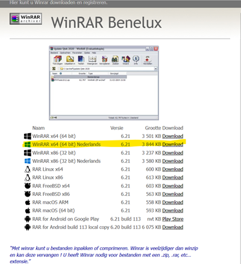

# Bijlage B: Zipjes uitpakken. {#bijlage-b-zipjes-uitpakken. .unnumbered}

Eén van de software programmaatjes om Zip-files is WinRAR. Ga naar <https://www.winrar.nl/>. Download hier de versie die geschikt is voor je operating systeem.

Na installatie kun je in je windows-verkenner rechtsklikken op de zipfile en dan kiezen voor ***Hier uitpakken.***

