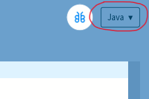
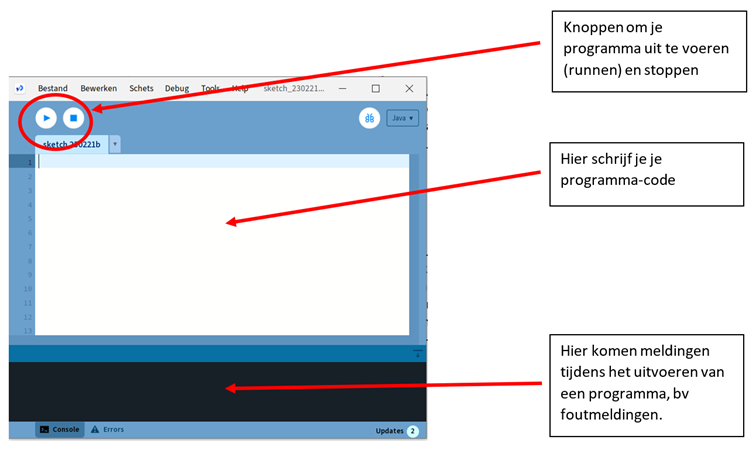
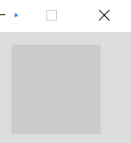

# Aanpak

We starten voor nu even met Processing in de Java modus.

Start Processing en kies voor de Java modus in de rechter bovenhoek:

Je hebt nu de zogeheten editor gestart, die er als volgt uitziet:

Klik op de Run-knop. Als het goed is verschijnt ongeveer midden in je scherm het volgende venster. Dit is het venster waarin je game zich gaat afspelen (wat de speler dus te zien krijgt)

Dus zonder dat we nog maar 1 regel code hebben geschreven, gebeurt er toch al heel wat op de achtergrond. Wat je ziet is een venster met daarin een vierkant van 100 x 100 pixels groot. En wat je niet ziet, en toch gebeurt, is dat dit venster 60 keer per seconde opnieuw wordt getekend.

Dit venster moet dus uiteindelijk ons spel worden!

We moeten dus code-regels schrijven in de editor zodanig dat we uiteindelijk ons idee van de game kunnen realiseren. Om dat te kunnen doen moeten we eerst gaan bedenken welke stappen in welke volgorde we moeten gaan zetten om ons doel (game) te bereiken. Oftewel we moeten een **algoritme** bedenken.

Er zijn meerdere wegen die naar Rome leiden, dus er is geen sprake van **hét juiste** algoritme. Ook kan het zijn dat het algoritme wat je hebt bedacht in de praktijk niet altijd handig is. Meestal gaat het dan om de volgorde van de stappen. Dus een algoritme helpt je, maar is niet heilig.