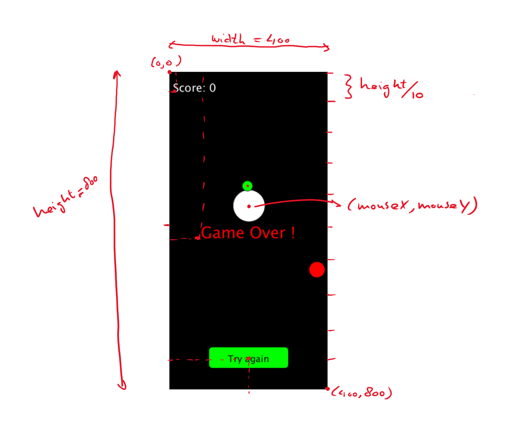

# Algoritme

1.  Maak het scherm 400 x 800 pixels

2.  Schrijf een tekst in linker-boven hoek met de score.

3.  Teken een groene cirkel (het coronavirus) op een bepaalde\*) positie.

4.  Teken een gele cirkel (de held) op de positie waar de muis staat (later: waar het scherm wordt aangeraakt op de mobiel)

5.  Teken een rode cirkel (de appel) op een bepaalde\*) positie.

6.  Als held de appel raakt dan score met 1 ophogen, appel 'spawnen' op een nieuwe willekeurige positie. Spawnen betekent niets meer dan nieuwe coordinaten bepalen voor de appel.

7.  Check of coronavirus botst met de held (= gele cirkel raakt groene cirkel) . Als dat zo is dan game-over.

8.  Als game-over dan schrijf de tekst "Game Over" in het midden van het scherm.

9.  Als game-over, teken een knop (rechthoek met afgeronde hoeken) onderin het scherm (op ongeveer 1/10de vanaf onderrand in het midden) met de tekst "try again" erin.

10. Laat het coronavirus een stap richting de held zetten.

11. Als game-over en er is op de "try again" button geklikt dan start het spel opnieuw.

Stappen 2 t/m 11 worden elke keer uitgevoerd voordat het scherm wordt ververst. Dit betekent dat dit ongeveer 60 keer per seconde gebeurt.

\*) Met bepaalde positie wordt in het geval van het coronavirus bedoelt dat elke keer als het scherm ververst wordt het virus een stap in de richting van de held zet. In het geval van de appel wordt de positie random bepaalt bij het spawnen van de appel. Deze positie houdt hij totdat hij opgegeten wordt en er een nieuwe appel gespawned wordt met een random nieuwe positie.

In onderstaand plaatje zijn wat afmetingen getekend, die kunnen ons helpen om verschillende onderdelen op de juiste plek te tekenen.

Belangrijk om op te merken dat de linker boven hoek het nulpunt is (0,0) en dat de positieve x-richting naar rechts is en de positieve y-richting naar beneden. Dit in tegenstelling tot een wiskundig assenstelsel, waarin het nulpunt links onder is en de positieve y-richting naar boven.

