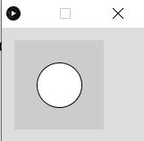
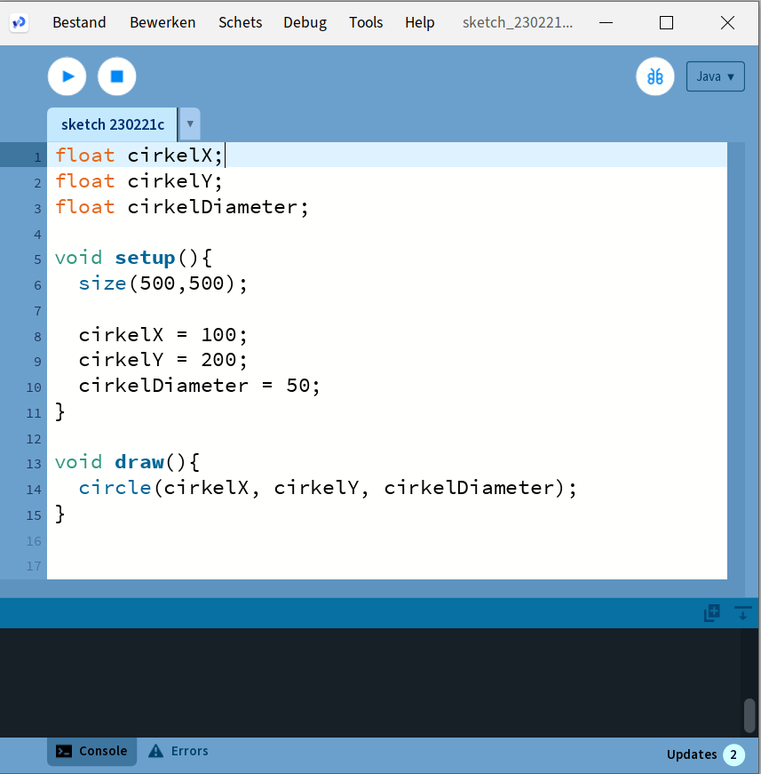
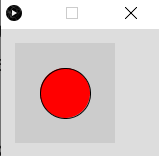

# Programmeren

## Functies

Zoals eerder gezegd hoef je veel dingen niet helemaal zelf te programmeren. Processing heeft al een hele hoop standaard 'dingen' beschikbaar. In de Reference ([Processing Reference](https://processing.org/reference)) vind je deze terug.

Deze 'dingen' worden functies genoemd. Een functie is eigenlijk 1 of meer instructies, die samen een bepaalde handeling uitvoeren. Het is makkelijker om dit duidelijk te maken met een voorbeeld.

Neem bijvoorbeeld de functie **circle(x, y, d)**. Deze functie tekent een cirkel met als middelpunt (x,y) en diameter d.

Probeer maar.

Type **circle(50, 50, 50);** in de editor en klik op de Run-button. Het resultaat ziet er dan zo uit:



Let op de accolade (;) aan het eind van een regel is belangrijk. Zo weet Processing ook dat de regel daar eindigt. Anders leest het gewoon door op de volgende regels, en beschouwt dat dan als 1 lange regel.

Er wordt een cirkel met straal 50 getekend, precies midden in het venster.

Om de kleur en de rand van de cirkel te veranderen, bestaan er andere functies die dit voor je kunnen doen. Hierover later meer.

Door andere waarden mee te geven, kun je cirkels van verschillende groottes en op verschillende posities tekenen. Aan deze functies kun je dus zelf **niets** veranderen door instructies toe te voegen.

Processing heeft ook een aantal functies die je wel zelf invulling moet geven. De belangrijkste 2 functies zijn de **setup()** en de **draw().** Deze worden door Processing zelf aangeroepen, bij het starten en runnen van het programma. De **setup()** wordt eerst, eenmalig, uitgevoerd, hierin kun je dus dingen doen die eenmalig uitgevoerd moeten worden, zoals de grootte van het scherm opgeven. De **draw()** zorgt voor het tekenen van het venster, deze wordt dus 60 keer per seconde uitgevoerd. In de schermafbeelding op de volgende bladzijde zie je hoe dat eruit ziet.

Wat er binnen deze functies uitgevoerd wordt, dat moeten we zelf programmeren. In deze functies komt het grootste gedeelte van ons algoritme terecht.



De functies die we gaan gebruiken zijn:

**size(b, h)** Geeft het venster de breedte b en de hoogte h.

**background(r, g, b)** Geeft de achtergrond van het venster een rgb kleur (rgb staat voor: red, green, blue). De r,g en b waarde is een getal tussen de 0 en 255. En geeft de mate aan waarin de kleuren rood, groen en blauw in het kleurmengsel aanwezig zijn. Dus 0,0,0 is zwart (afwezigheid van alle kleuren) en 255,255,255 is wit (aanwezigheid van alle kleuren in maximale hoeveelheid).

**text("text", x, y)** Print de tekst "text" op positie (x,y)

**textSize(s)** Zet de lettergrootte op **s** pixels

**textAlign(LEFT)** Zorgt ervoor dat de tekst links wordt uitgelijnd. Dit betekent in dit geval dat de tekst begint op positie (x,y) en dan naar rechts wordt geschreven. Let op: LEFT moet ook echt in hoofdletters geschreven worden.

**textAlign(CENTER, CENTER)** Zorgt ervoor dat een tekst zodanig geschreven wordt dat het punt (x,y) precies in het midden/centrum van de tekst is.

**fill(r, g, b)** Deze functie bepaalt de kleur waarmee de daaropvolgende figuur of tekst wordt geschreven. Dus als je een zwarte cirkel wilt tekenen midden in het standaard scherm dan wordt het:

> fill(0, 0, 0);\
> circle(50, 50, 50);\
> 
>
> Een rode cirkel wordt dan:
>
> fill(255, 0, 0);\
> circle(50, 50, 50);\
> 

**circle(x, y, d)** Tekent een cirkel met diameter d op positie (x,y).

**rect(x, y, b, h, r)** Tekent een rechthoek met de linker-boven hoek op positie (x,y) en een breedte b en hoogte h. De r geeft de ronding van de hoeken aan (0 is een rechte hoek)

**rectMode(CENTER)** Zorgt ervoor dat het punt (x,y) precies in het midden(centrum) van de rechthoek uitgelijnd wordt. Vergelijkbaar met textMode(CENTER, CENTER).

**random(min, max)** Deze functie geeft een willekeurig getal terug tussen de waarden min en max. B.v. zou random(0, 10) het getal 4,15389 terug kunnen geven. Maar als ik hetzelfde nog een keer uitvoer kan er een heel ander getal uitkomen. Niet te voorspellen dus, oftewel willekeurig (= random).

**millis()** Bepaalt het aantal verstreken milliseconden sinds het opstarten van het spel.

**dist(x1, y1, x2, y2)** Berekent de afstand tussen de punten (x1,y1) en (x2,y2)

Dit zijn voor nu even de belangrijkste bouwstenen voor ons, om een start te maken met ons spel. Later zullen we de cirkels gaan vervangen door plaatjes (images), m.b.v. de volgende functies.

**image(img, x, y, h, b)** Tekent het plaatje **img** op positie (x, y) met een hoogte van h en een breedte van b.

**loadImage("filename.png")** Laadt een afbeelding/plaatje in. Deze is van het type png, gif of jpg.

**imageMode(CENTER)** Zorgt ervoor dat het punt (x,y) precies in het midden van het plaatje is.

In [Bijlage D](bijlage-d.md) staan alle functies van Processing die we gaan gebruiken nog iets uitgebreider uitgelegd (vertaling van [Reference Processing](https://processing.org/reference))

## Variabelen

Een ander belangrijk bergrip in programmeren zijn variabelen. Soms heb je een bepaalde (berekende) waarde meer dan één keer nodig in je programma. In dat geval kun je -- i.p.v. die waarde steeds opnieuw te berekenen -- de waarde opslaan in een variabele en dan gewoon de naam van de variabele gebruiken. Technisch gezien is een variabele een plekje in het geheugen van de computer die je zelf een (duidelijke en logische) naam kunt geven en waar je vervolgens een waarde aan kunt geven, en deze waarde kun je vervolgens ook wijzigen. Om je daar een voorstelling van te kunnen maken, zou je een variabele kunnen zien als een doosje waar je een bepaalde waarde instopt en die je er ook weer uit kunt halen en zelfs wijzigen.

Een variabele maken, noemen we '**declareren**'. Je moet de computer laten weten hoe je variabele moet gaan heten. Een variabele een waarde geven noemen we **'initialiseren'**.

In veel programmeertalen moet je ook aangeven wat het zogeheten **type** van de variabele is. Is het een geheel getal, of een komma-getal, of een tekst? Dit zijn veel voorkomende types, maar je kunt ook variabelen maken die een plaatje kunnen bevatten.

De types die wij gaan gebruiken voor het spel zijn:

-   **int** hier kunnen gehele getallen (integers) in.

-   **float** voor komma-getallen.

-   **String** voor tekst.

> Let op: Processing is hoofdletter gevoelig, als je **Int** zou schrijven i.p.v. **int**, dan krijg je een foutmelding. **String** wordt, anders dan de andere types, met een hoofdletter geschreven. Dit is dus geen typefout. Waarom dit zo is, is op dit moment niet zo belangrijk.

-   **boolean** deze kan 2 waarden bevatten, **true** of **false** (waar of nietwaar). Een beetje

> een vreemde variabele misschien, maar deze is enorm handig in situaties, waarbij je afhankelijk van of iets waar of nietwaar is, iets wel of juist niet wil doen.

-   **Pimage** hier kun je plaatjes in opslaan.

Je kunt nu bijvoorbeeld een variabele **leeftijd** maken, waar je je leeftijd in op kan slaan (b.v. 13). Dit kun je als volgt doen:

**int leeftijd;** met deze regel declareer je de variabele

**leeftijd = 13;** hier geef je de variabele een waarde

Dit kan ook in 1 keer:

**int leeftijd = 13;**

In ons programma declareren we variabelen helemaal boven in het programma, boven de **void setup()**. In de **setup()** zelf geven we onze variabelen een start-waarde.

Dus bovenstaande variabele zouden we in ons programma als volgt kunnen definiëren en een waarde geven:

```java
int leeftijd;

void setup(){
   leeftijd = 13;
}
```

Naast standaard functies heeft Processing ook een aantal handige standaard variabelen. Degene die wij in ons spel gaan gebruiken zijn:

**width** hierin is de breedte van het venster opgeslagen

**height** hierin is de hoogte van het venster opgeslagen

**mouseX** hierin is de x-positie van de muis-cursor (pijltje) opgeslagen

**mouseY** hierin is de y-positie van de muis-cursor (pijltje) opgeslagen

**mousePressed** hierin is opgeslagen of je de linker muis knop hebt ingedrukt of niet. Deze heeft dus de waarde **true** (er is op de linker button geklikt) of **false** (er is niet geklikt).

Deze variabelen krijg je cadeau, en hoef je dus niet zelf te maken en dus ook niet bovenin je programma op te schrijven.

## Wiskundige operatoren

In alle programmeertalen kun je ook wiskundige berekeningen uitvoeren. De belangrijkste voor nu zijn de onderstaande:

|Operator|Betekenis|
|---|:---|
|\+|optellen|
|\-|aftrekken|
|/|delen|
|\*|vermenigvuldigen|

Deze werken overigens alleen met getallen. Zo zal **println(10.2 + 3.5)** de volgende regel in de console printen:

**13.7**

Je kan natuurlijk ook berekening uitvoeren met variabelen, deze moeten dan wel van het type **int** of **float** zijn (er zijn nog meer standaard typen die getallen kunnen bevatten, maar die laten we even buiten beschouwing).

De volgende code:
```java
float getal1 = 10.2;
float getal2 = 3.2;
println(getal1 + getal2);
```

Levert dezelfde output op:

**13.7**

Zoals gezegd werk dit dus alleen met getallen. Een uitzondering is de + operator. Deze werkt ook op strings en variabelen van het type **String.** Het effect hiervan is dat de teksten die 'opgeteld' worden, als het ware aan elkaar 'geplakt' worden. Even een voorbeeld:

**println("Hello" + "World");**

levert als output in de console:

**HelloWorld**

Let op: Zoals je ziet zonder spatie!

Met variabelen, zou het als volgt eruit kunnen zien:

```java
String groet = "Hello";
String iedereen = "World";
println(groet + iedereen);
```

Dit levert dezelfde output op:

**HelloWorl**d

Wil je een spatie tussen de woorden dan zal je die zelf moeten toevoegen, bijvoorbeeld als volgt:

**println("Hello" + " " + "World");**

of

**println(groet + " " + iedereen);**

Dit werkt ook met combinaties van Strings en integer:

**println("Mijn leeftijd is: " + 13);**

levert op

**Mijn leeftijd is: 13**

Mooier is natuurlijk om dit behulp van een variabele te doen, dus:

```java
int leeftijd;
leeftijd = 13;
println("Mijn leeftijd is: " + leeftijd);
```

Dit levert dezelfde output op, maar is flexibeler in gebruik. Ik hoef dan alleen de waarde van de variabele **leeftijd** te wijzigen, om een andere zin te printen.

## Condities

Vaak wil je pas iets uitvoeren als er aan een bepaalde voorwaarde (conditie) is voldoen. Processing heeft hiervoor het **if**-statement.

De syntax (schrijfwijze) hiervan is:

```java
if ( conditie ) {
   statement1;
   statement2;
   //etc...
}
```

Let hier op de () en {}, deze zijn verplicht!

Je kan deze if lezen als: **ALS** conditie waar is **DAN** voer de statements uit.

Een voorbeeld. Stel ik heb een spel waarin de speler een aantal levens heeft. Als deze op zijn dan is het spel voorbij en wordt er "Game Over" in het midden van het scherm geprint. Het aantal levens hou ik bij in een variabele met de naam **aantalLevens**.

Dan zou ik het bovenstaande als volgt kunnen programmeren:

```java
if (aantalLevens == 0) {
   text("Game Over", width / 2, height / 2);
}
```

Let op de dubbele ==, dit kun je lezen als 'is gelijk aan'. In tegenstelling tot de enkele =, die gebruikt wordt om een 'waarde toe te kennen' aan een variabele.

De volgende vergelijkingen zijn beschikbaar:

|Vergelijking|Betekenis|
|---|:---|
|==|is gelijk aan|
|\<|is kleiner dan|
|\>|is groter dan|
|\<=|is kleiner of gelijk|
|\>=|is groter of gelijk|
|!=|is ongelijk aan (de ! kun je lezen als 'is niet')|

Ook is het mogelijk om het if-statement uit te breiden met wat er zou moeten gebeuren als niet aan de conditie is voldaan.

```java
if ( conditie ) {
   statement1;
   statement2;
} else {
   statement3;
}
```

Dit kan je lezen als: **ALS** conditie waar is **DAN** voer de statement1 en statement2 uit **ANDERS** voer statement3 uit.

Als je meerdere condities hebt die moeten gelden, kun je deze 'koppelen' door er && (en) tussen te zetten of \|\| (of). De '\|' zit op je toetsenbord, rechts, boven de Enter toets.

```java
if (conditie1 && conditie2){
   statement1;
}
```

Dit kun je lezen als: **ALS** conditie1 **EN** conditie2 waar zijn **DAN** voer statement1 uit.

```java
if (conditie1 || conditie2){
   statement1;
}
```

Dit kun je lezen als: **ALS** conditie1 **OF** conditie2 waar is **DAN** voer statement1 uit.

## Standaarden/ Afspraken

In de wereld van de programmeurs is het gebruikelijk om bepaalde standaarden af te spreken, hoe je code schrijft. Enkele afspraken zijn:

Variabelen worden in zogeheten camelCase geschreven. Dit betekent dat een naam van variabele altijd begint met een kleine letter en dat vervolgens ieder zelfstandig naamwoord in die naam begint met een hoofdletter, bijvoorbeeld

```java
int diameterCirkel;
float gespaardBedrag;
```

Ook is het belangrijk om duidelijke namen te kiezen, bij voorkeur namen die iets zeggen over de waarde die je erin stopt. Zoals bovenstaande voorbeelden.

Verder is het voor de leesbaarheid van je code belangrijk dat je af en toe wat lege regels toevoegt, na bijvoorbeeld een if-statement of voor en na de setup() en draw().

Voeg spaties toe na een komma, voor en na de "=", voor en na een wiskundige operator (b.v. "+"). Dit verhoogt ook de leesbaarheid van je code.

Code die heel compact geschreven is, dus zonder spaties en lege regels, is vaak moeilijker te lezen.

Een andere, belangrijke afspraak, die ook de leesbaarheid verhoogt, is het volgende. Na een "{" begin je de volgende regel met inspringen. Dat wil zeggen dat je een aantal spaties toevoegt vóór de regel, meestal 3.

Je hebt in deze reader daar al wel wat voorbeelden van gezien. Bijvoorbeeld bij de draw() en setup(), maar ook bij het if-statement.

```java
if ( conditie ) {
   statement1;
   statement2;
} else {
   statement3;
}
```

Zie je dat na een "}" de nieuwe regel begint met een aantal spaties?

Merk op dat bij een "}" er weer van voren af aan begonnen wordt met de regel.
