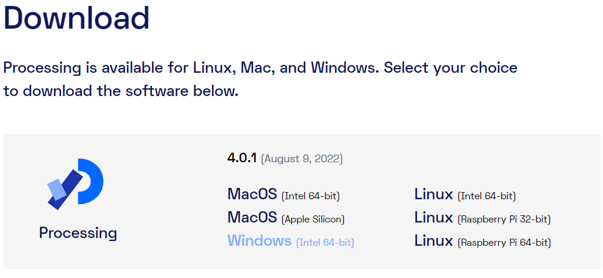

## Stap 1: Processing downloaden

Download de laatste versie van Processing (versie 4.0.1) via de volgende link: <https://processing.org/download>.

Kies de download die geschikt is voor jou operating systeem. In de meeste gevallen is dit Windows. Om te bepalen of je de 64-bit of de 32-bit moet hebben, kun je de instructie in [Bijlage A](bijlage-a.md) raadplegen. In de meeste (nieuwere) laptops is dit 64-bit