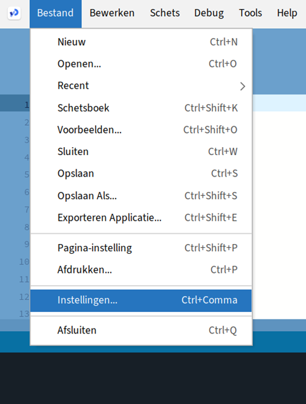

# Stap 6: 'Automatische aanvulling' aanzetten

Een heel handige optie om aan te zetten is de 'Automatische aanvulling'. Wanneer je dit aanzet kun je wanneer je een gedeelte van een woord hebt getypt, 'ctrl spatie' toetsen, en dan geeft processing een lijstje met mogelijke opties. Dit kan je veel typewerk schelen.

Om dit in te stellen ga je naar Instellingen: Bestand\>Instellingen...

Vink de check box bij 'Automatische aanvulling Ctrl-Spatie' aan.

Wanneer je nu bv virus typt en dan Ctrl-Spatie, krijg je een lijstje met opties, in dit geval de namen van variabelen. Met de pijltjestoetsen + Enter kun je er 1 kiezen (of aanklikken met de muis)

