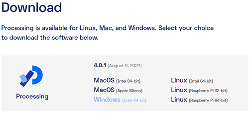
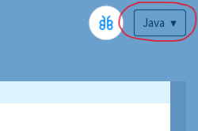
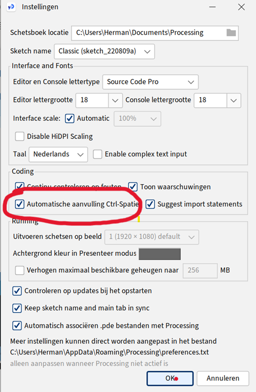
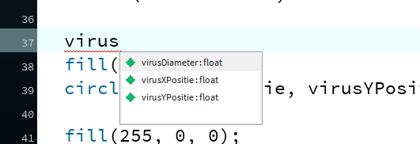

# Voorbereiding

Voordat je van start kan gaan, moet Processing eerst geïnstalleerd worden op je computer.

## Stap 1: Processing downloaden

Download de laatste versie van Processing (versie 4.0.1) via de volgende link: <https://processing.org/download>.

Kies de download die geschikt is voor jou operating systeem. In de meeste gevallen is dit Windows. Om te bepalen of je de 64-bit of de 32-bit moet hebben, kun je de instructie in [Bijlage A](bijlage-a.md) raadplegen. In de meeste (nieuwere) laptops is dit 64-bit

## Stap 2: Zipfile verplaatsen van Downloads naar map naar keuze

Verplaats de gedownloade Zipfile (***processing-4.0.1-windows-x64.zip***) naar een map van je keuze, bij voorkeur naar ***C:\\Program Files*.** 
Verplaatsen van een bestand kan door het te verslepen naar de nieuwe directory of door te selecteren en dan **Ctrl-c** en naar de nieuwe directory te gaan en hier **Ctrl-v** doen.

## Stap 3: Uitpakken Zipfile

Pak de Zip file hier uit. Zie [Bijlage B](bijlage-b.md), als je niet weet hoe je dat kunt doen.

## Stap 4: Starten Processing

Ga naar de map ***C:\\Program Files\\processing-4.0.1.***

Om Processing te starten dubbelklikken op ***processing.exe***.

(Maak er een snelkoppeling van op je Bureaublad, om in vervolg Processing makkelijk op te kunnen starten. Rechtsklik met de muis op de file ***processing.exe*** en kies '***Kopiëren naar \>***' en vervolgens '***Bureaublad (snelkoppeling maken)***')

Je krijgt een welkom bericht. Zet het vinkje hiervan uit, en klik vervolgens op ***Get started.***

Normaal gezien zou je nu klaar zijn om een game te maken. Maar om uiteindelijk je game op een Android telefoon te kunnen zetten, moet je nog aan aantal extra stappen uitvoeren.

## Stap 5: Toevoegen Android Modus

Klik in de rechterbovenhoek op het vakje met **Java**, kies vervolgens voor **Manage Modes**...

In het scherm dat vervolgens verschijnt, kies je voor **Anroid Mode for Processing 4**, en klik op de **Install** knop.

## Stap 6: 'Automatische aanvulling' aanzetten

Een heel handige optie om aan te zetten is de 'Automatische aanvulling'. Wanneer je dit aanzet kun je wanneer je een gedeelte van een woord hebt getypt, 'ctrl spatie' toetsen, en dan geeft processing een lijstje met mogelijke opties. Dit kan je veel typewerk schelen.

Om dit in te stellen ga je naar Instellingen: Bestand\>Instellingen...

Vink de check box bij 'Automatische aanvulling Ctrl-Spatie' aan.

Wanneer je nu bv virus typt en dan Ctrl-Spatie, krijg je een lijstje met opties, in dit geval de namen van variabelen. Met de pijltjestoetsen + Enter kun je er 1 kiezen (of aanklikken met de muis)

